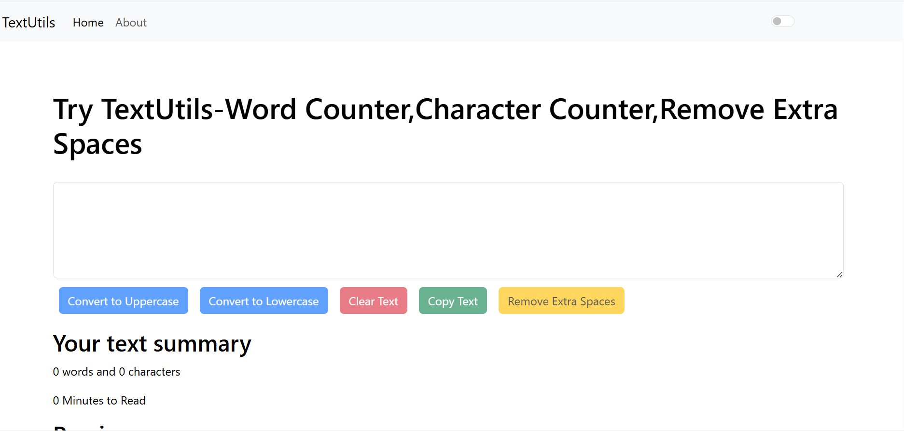
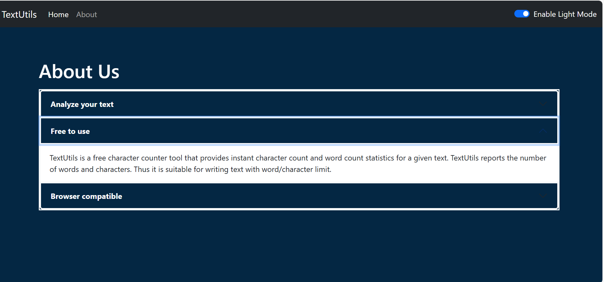

# TextUtils_React

TextUtils is a simple React-based utility web app for analyzing and manipulating text. It allows users to perform operations like converting text to uppercase/lowercase, removing extra spaces, copying text to clipboard, and more. It also includes light and dark modes for better accessibility and aesthetics.


## 🛠️ Features

- ✅ Convert text to **Uppercase** / **Lowercase**
- ✅ **Clear** the entire text input
- ✅ **Copy** text to clipboard
- ✅ **Remove** extra spaces
- ✅ Word & character **count**
- ✅ **Reading time** estimate
- ✅ **Preview** typed text
- ✅ **Dark/Light mode** toggle
- ✅ **Responsive** design using Bootstrap
- ✅ Built-in **Alert system** for notifications

---

## 📸 Screenshots

>
>

---

## 🚀 Getting Started

### 1. Clone the repository

```bash
git clone https://github.com/GauriAyalane18/TextUtils_React.git
cd my_app

2. Install dependencies
npm install

3. Run the application
npm start
The app will start on http://localhost:3000.

🔧 Project Structure
textutils/
│
├── public/
├── src/
│   ├── components/
│   │   ├── About.js
│   │   ├── Alert.js
│   │   ├── Navbar.js
│   │   └── Textform.js
│   ├── App.js
│   ├── App.css
│   └── index.js
│
├── package.json
└── README.md
